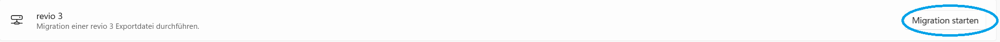
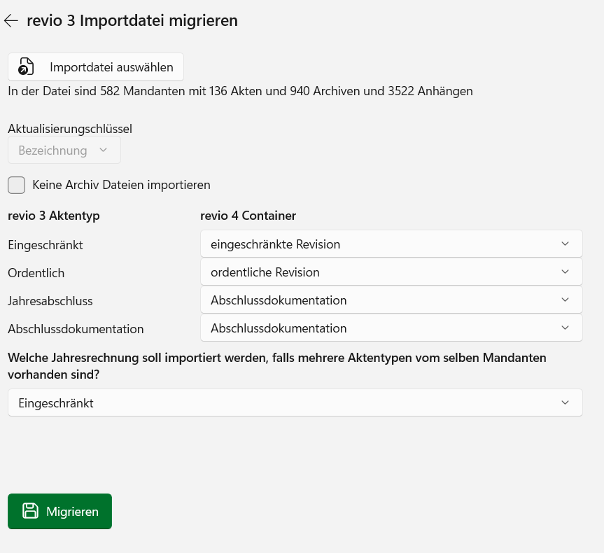

# revio 4 - Migrationsimport

Der **Migrationsimport** in revio 4 liest die vom revio Migration Tool erstellte ZIP-Exportdatei ein und überführt die Legacy-Daten in die neue revio 4 Datenstruktur.

## Migrationsablauf

Die Migration von revio Legacy nach revio 4 erfolgt in zwei Schritten:

1. **Datenextraktion (revio Migration Tool):** Das Migration Tool extrahiert alle relevanten Daten für das gewählte Umstellungsjahr aus der Legacy-Datenbank und erstellt eine ZIP-Exportdatei. Siehe dazu die [Dokumentation zum Migration Tool](revio-migrator.md).

2. **Import in revio 4 (diese Dokumentation):** Die erstellte ZIP-Datei wird in revio 4 hochgeladen und verarbeitet. revio 4 transformiert die Daten und erstellt die entsprechenden Strukturen.

> **Wichtig:** Vor dem Import müssen alle Mitarbeiter in revio 4 angelegt sein. Verwenden Sie dabei **dieselben Visa** wie in revio 3, damit die Zuordnungen korrekt übernommen werden.

### Was wird migriert?

Da revio 4 viele Bereiche neu und besser umsetzt, können nicht alle Daten 1:1 übernommen werden.

#### Mandanten und Akten

- **Alle Mandanten** werden vollständig übernommen
- **Alle Akten** für das gewählte Extraktionsjahr werden übernommen

#### Jahresrechnung

- **Konten** werden übernommen
- **Spiegelgruppen** und **Umbuchungen** werden erstellt
- **Stille Reserven** werden übernommen (müssen im revio 4 den Bilanz- und Erfolgsgruppen zugeordnet werden)
- **Bilanz-, ER- und Geldflussstruktur** werden *nicht* übernommen

> **Hinweis zur Jahresrechnung:** Im revio 4 gibt es nur noch eine Jahresrechnung pro Mandant (nicht mehr pro Akte). Falls im revio 3 mehrere Aktentypen mit unterschiedlichen Jahresrechnungen pro Mandant existieren, muss beim Import festgelegt werden, welcher Aktentyp als Jahresrechnungsbasis dient.

#### Prüfungsdokumentation

Folgende Bereiche werden mit allen zugehörigen Anhängen übernommen:

- **Allgemeine Prüfungshandlungen**
- **Notizen**
- **Dauerakten**

#### Sonstige Anhänge

Alle anderen Anhänge, die nicht in die oben genannten Bereiche fallen (z.B. Checklisten, Spezial-Prüfgebiete), werden in der Akte im Bereich **Belege** zur Wiederverwendung bereitgestellt.

#### Archiv

Alle **archivierten PDF-Akten** werden ins revio 4 Archiv übertragen.

### Was wird NICHT migriert?

| Bereich | Grund | Aktion erforderlich |
|---------|-------|---------------------|
| **Mitarbeiter** | Login in revio 4 ist neu E-Mail-basiert statt Visum-basiert | Mitarbeiter manuell in revio 4 anlegen. **Wichtig:** Dasselbe Visum wie in revio 3 verwenden! |
| **Bilanz-/ER-/Geldflussstruktur** | Neue auf Kontenklassen basierte Strukturlogik in revio 4 | Vordefinierte Standard-Strukturen vom revio 4 verwenden. Punktuell anpassen |
| **Checklisten** | Umstellung auf Formulareingabe statt Excel-Style | Neue Formulare in revio 4 verwenden |
| **Prüfungsplanung** | Komplett überarbeitet in revio 4 | Neue Prüfungsplanung in revio 4 verwenden |
| **Funktionsprüfungen** | Komplett überarbeitet in revio 4 | Neues Kontrollsystem in revio 4 verwenden |
| **Spezialprüfungen (SA-CH 2022)** | Komplett überarbeitet in revio 4 | Besondere Prüfgebiete in revio 4 verwenden |

## Voraussetzungen

- Eine gültige ZIP-Exportdatei vom revio Migration Tool
- Alle Mitarbeiter müssen in revio 4 angelegt sein (mit identischen Visa)
- Ausreichende Berechtigungen für den Datenimport (Administrator)

## Import durchführen

### Schritt 1: Migration starten

1. Melden Sie sich in revio 4 an
2. Klicken Sie unten links auf **Einstellungen** 
3. Wählen Sie **Migration starten** 

### Schritt 2: Migrationsdatei auswählen

1. Im Migrationsdialog  

   klicken Sie auf **Importdatei auswählen** 
2. Wählen Sie die vom revio Migration Tool erstellte ZIP-Datei aus
3. Nach dem Laden werden Informationen über den Inhalt der Datei angezeigt

### Schritt 3: Aktentypen zuweisen

Es werden alle importierbaren revio 3 Aktentypen angezeigt. Weisen Sie jedem Aktentyp den entsprechenden revio 4 Containertyp zu.

> **Hinweis:** Es werden nur lizenzierte revio 4 Container zur Auswahl angezeigt.

### Schritt 4: Jahresrechnung festlegen

Falls für einen Mandanten mehrere Akten mit unterschiedlichen Jahresrechnungen vorhanden sind, müssen Sie festlegen, welche revio 3 Jahresrechnung in revio 4 übernommen werden soll.

### Schritt 5: Archivimport konfigurieren

Der Archivimport kann aktiviert oder deaktiviert werden.

> **Tipp:** Archivimporte dauern am längsten. Für schnelle Tests kann der Archivimport deaktiviert werden.

### Schritt 6: Import starten

Starten Sie den Import. Der Fortschritt wird angezeigt.

## Wiederholter Import

Die Migrationsdatei kann beliebig oft importiert werden. Dabei gilt:

- Es wird jeweils die **AktenId aus revio 3** verwendet
- Falls eine Akte von einer vorherigen Migration bereits existiert, wird diese **überschrieben**
- **Ausnahme:** Sobald der Status einer Akte nicht mehr auf "migriert" steht, wird diese Akte nicht mehr überschrieben

> **Hinweis:** Diese Logik ermöglicht es, die Migration mehrfach zu testen, ohne bereits bearbeitete Akten zu verlieren.
